# 1. 创建功能包

  ros2 pkg create my_robot_sim --build-type ament_cmake --dependencies rclcpp std_msgs geometry_msgs sensor_msgs nav_msgs ackermann_msgs

  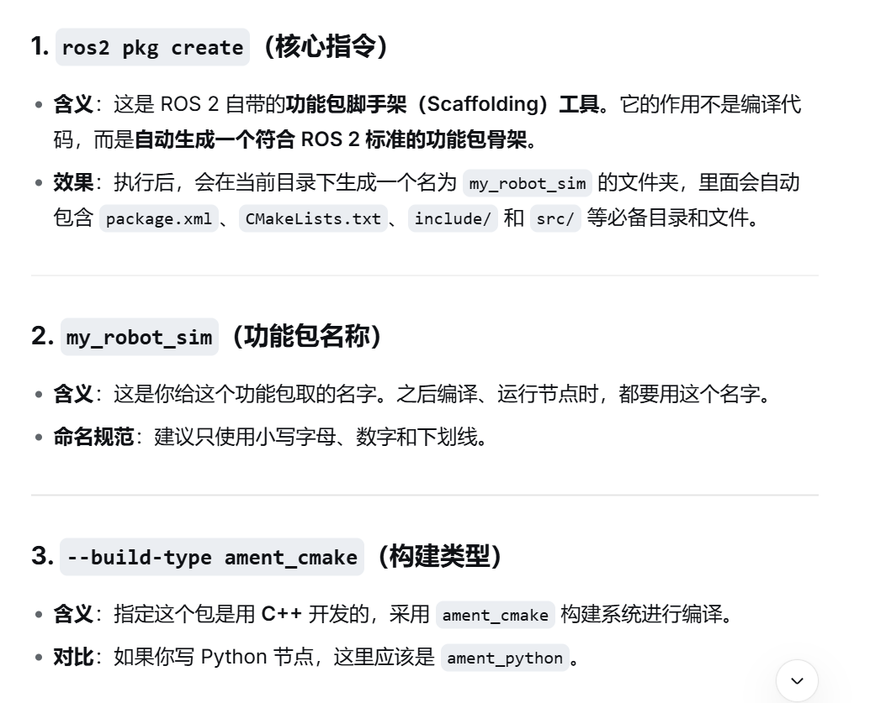

  依赖
  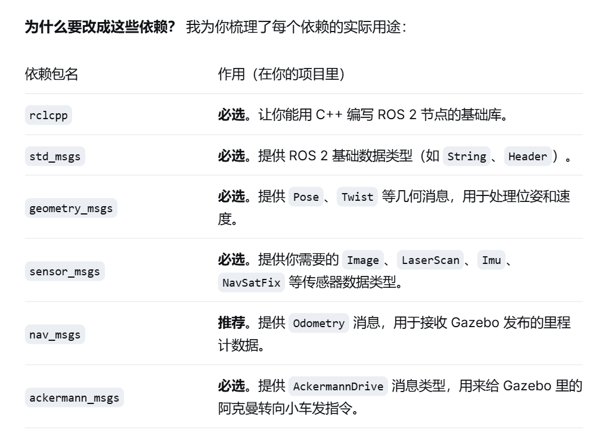

# 2.准备核心文件

 1.urdf

 2.launch

   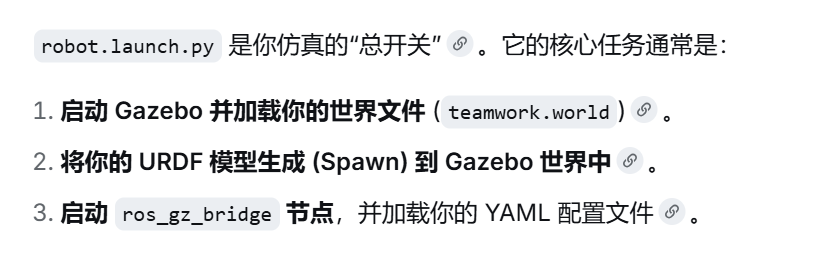

 3.桥接配置文件(YAML)

  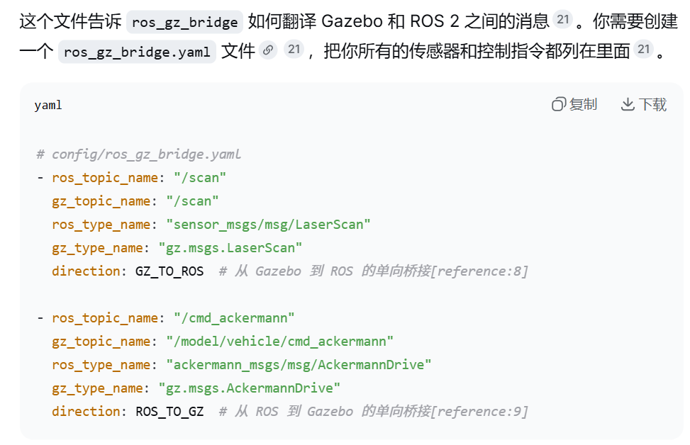

 4.编写控制节点(C++)

 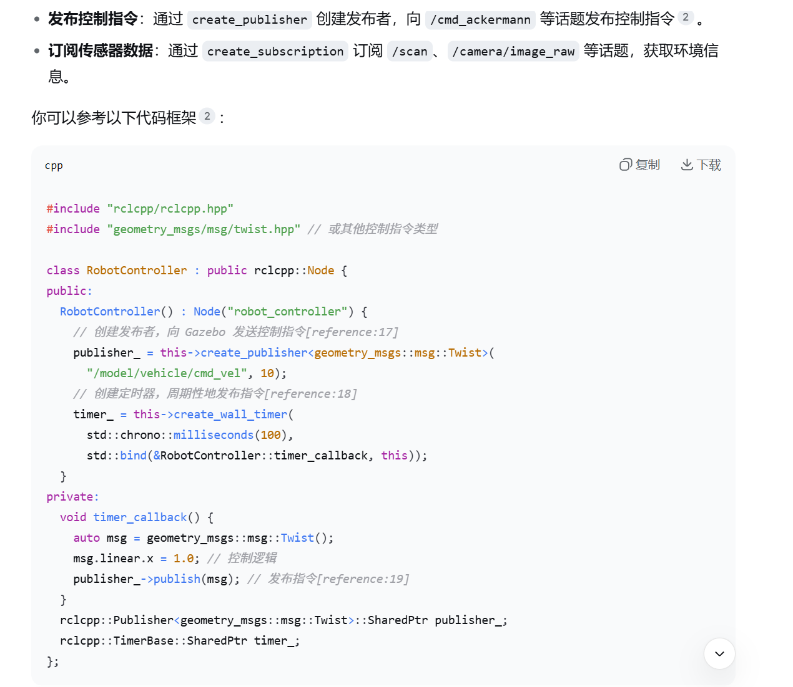

 （python）：
 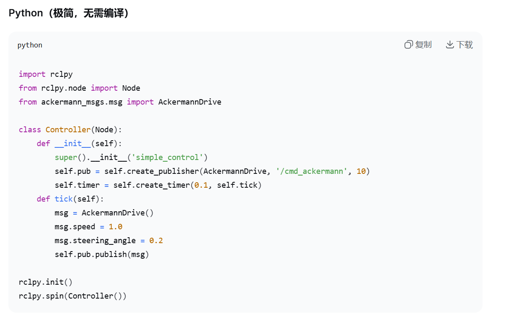

# 3. 编译运行：
   
   ### 3.1 编译：
       cd ~/your_workspace
      colcon build --packages-select 功能包名
      source install/setup.bash

   ### 3.2 运行：
   ros2 launch 功能包名 launch文件名.py

# run
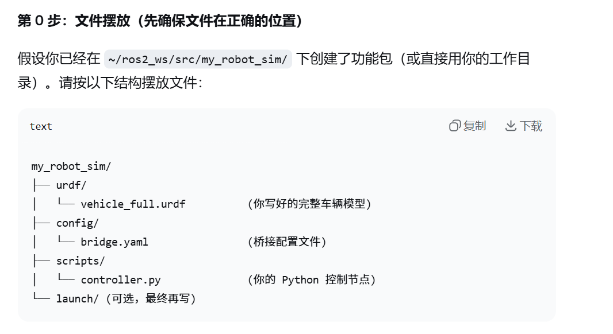
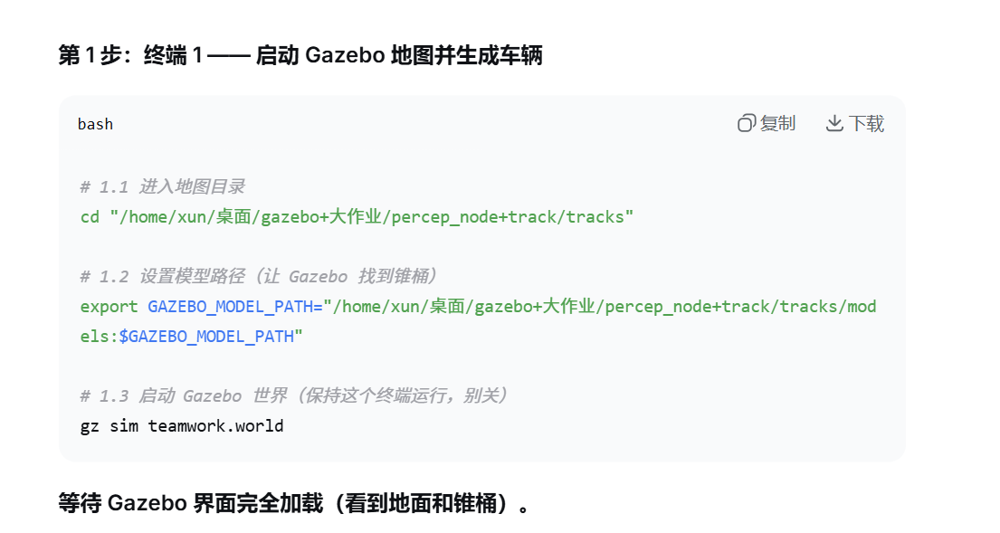
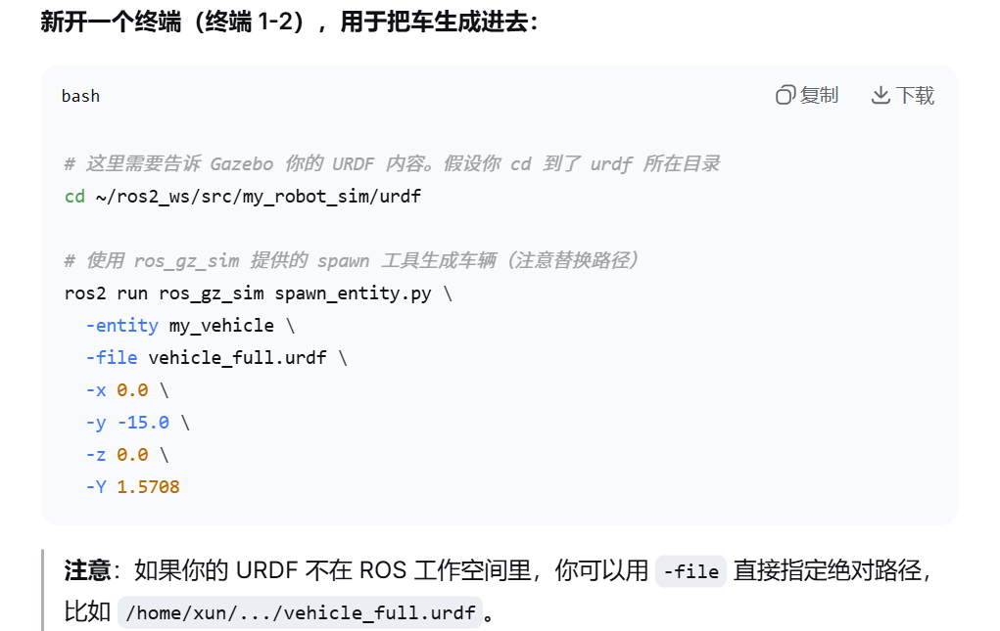
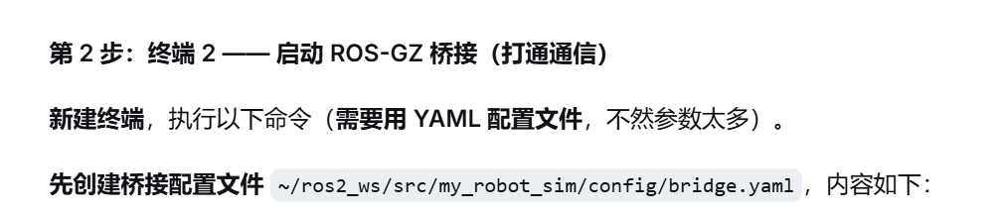
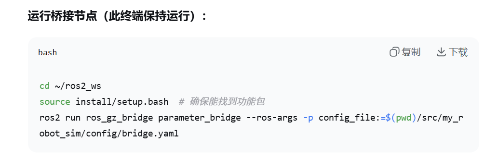
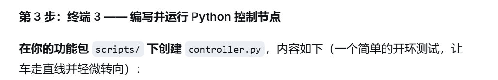
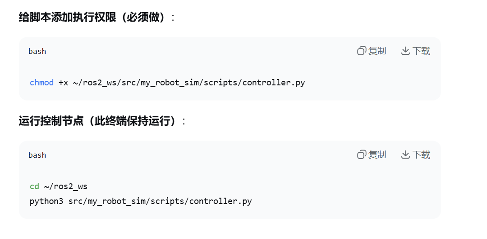
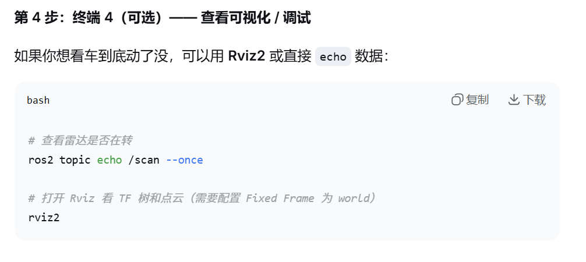